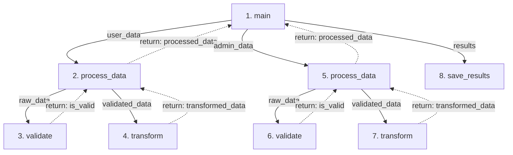

# Generate Function Flow Diagram

The `/code-viz` command creates visual Mermaid flowcharts showing how functions call each other and the execution flow in your code.

## Usage

```
/code-viz [options] <code_snippet_or_file>
```

## Options

### Detail Level
- `--simple` - Show only function names and calls (no parameters/returns)
- `--detailed` - Include parameters and return values (default)
- `--full` - Include internal logic branches and loops

### Scope
- `--entry-point <function_name>` - Start diagram from specific function
- `--depth <number>` - Limit call depth (default: unlimited)
- `--exclude <pattern>` - Exclude functions matching pattern (e.g., `--exclude "test_*"`)
- `--include-only <pattern>` - Only include functions matching pattern

### Output Options
- `--with-explanation` - Add text explanation of the flow (default)
- `--diagram-only` - Output only the Mermaid diagram
- `--add-legend` - Include a legend explaining node shapes

## Examples

```bash
# Basic usage - analyze a code snippet
/function-flow-diagram main.py

# Simple diagram without parameters
/function-flow-diagram --simple mycode.js

# Left-to-right flow starting from main()
/function-flow-diagram --direction LR --entry-point main app.py

# Detailed view with limited depth
/function-flow-diagram --detailed --depth 3 server.py

# Focus only on specific functions
/function-flow-diagram --include-only "process_*" data_pipeline.py
```

---

You are a code visualization expert. Generate Mermaid flowcharts that show the execution flow of functions in the provided code.

## Your Task

Analyze the user's code and create a clear, visual flowchart showing:
- Function names as nodes
- Parameters passed to functions (shown as labels on the edges to function calls)
- Return values from functions
- Function call relationships (which function calls which)
- Execution flow and dependencies

## Process

1. **Analyze the code** to identify:
   - All function definitions
   - Parameters each function accepts
   - Return values/types
   - Which functions call which other functions
   - The execution order/flow

2. **Create a Mermaid flowchart** using this structure:
   - Use `flowchart TD` (top-down) for the diagram type
   - Function nodes with execution order: `F0["1. function_name"]` (include sequence number)
   - Connect function calls with parameters on edges: `F0 -->|param1, param2| F1` (when F0 calls F1 with parameters)
   - If no parameters, simple arrow: `F0 --> F1`
   - Show return values as labels on return edges: `F1 -.->|return: value| F0` (use dotted line with return label)
   - Only show return edges when the return value is significant to understanding the flow
   - **Number the functions in execution order** to show the sequence clearly
   - **IMPORTANT**: Wrap all edge labels in quotes to avoid parser errors: `F0 -->|"param_name"| F1` (especially when labels contain underscores, spaces, or special characters)

3. **Format the output** as a proper Mermaid code block

## Example Output

For code with `main()` calling `process_data()` twice and `save_results()`:



## Guidelines

- Keep node labels concise and readable
- Use sequential IDs (F0, F1, F2...) for function node identifiers
- **Include execution sequence numbers in function names** (e.g., `"1. main"`, `"2. process_data"`)
- Number functions in the order they are called/executed
- **Duplicate function nodes for each invocation** - if `validate()` is called twice, create `F3["3. validate"]` and `F7["7. validate"]` as separate nodes
- This creates a cleaner, tree-like flow without criss-crossing edges
- Show parameters as labels on the arrows/edges connecting functions (solid arrows)
- Show return values as labels on dotted return edges back to the caller
- **Always wrap edge labels in quotes** (e.g., `|"param_name"|`) to prevent parser errors with underscores, spaces, or special characters
- Keep parameter and return labels short for better readability
- Only show return edges when the return value is important to understanding the flow
- Show the logical flow of execution
- For recursive functions, show the recursive call with a note
- Also add the diagram for "commented-out" functions, but make the box light yellow suggesting that the box has been greyed.
- For complex codebases, focus on the main execution path
- Add a brief text explanation of what the diagram shows

## Output Format

1. The Mermaid diagram in a code block
2. A brief explanation (2-3 sentences) describing the flow
3. Any notable patterns or relationships in the code structure

Now analyze the code provided and generate the function flow diagram.