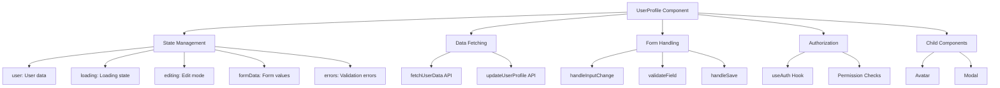
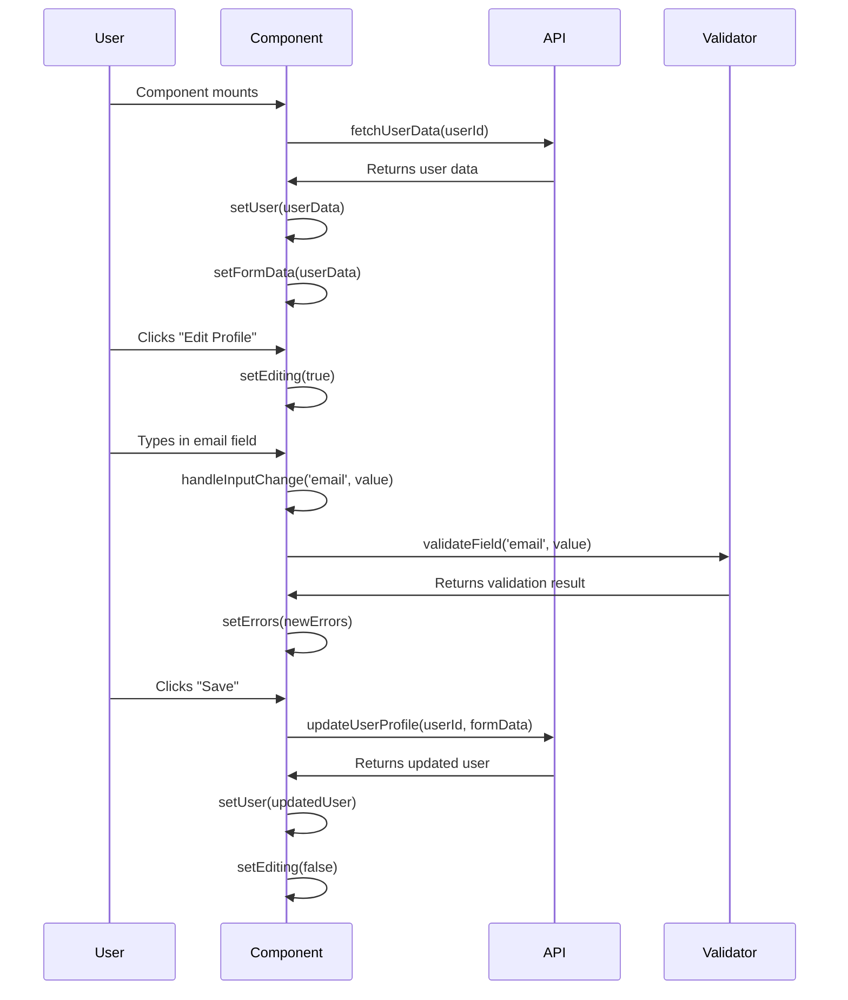
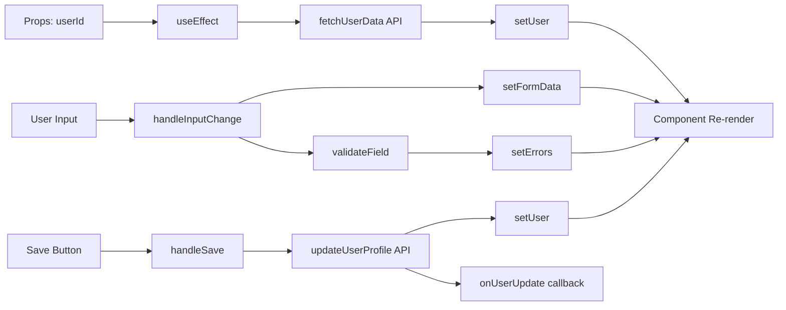

The `/explain` command provides comprehensive code explanations with visual diagrams, step-by-step execution flow, complexity analysis, and interactive examples to help understand any codebase.

## Usage

```
/explain [options] <code_or_file>
```

## Options

### Explanation Depth
- `--simple` - High-level overview for beginners
- `--detailed` - Comprehensive explanation (default)
- `--expert` - Technical deep-dive with optimizations
- `--academic` - Theoretical analysis with algorithms

### Visualization Options
- `--flowchart` - Generate execution flow diagrams
- `--architecture` - System architecture diagrams
- `--sequence` - Sequence diagrams for interactions
- `--uml` - UML class and relationship diagrams
- `--mermaid` - Generate Mermaid.js diagrams

### Analysis Focus
- `--performance` - Performance characteristics and complexity
- `--security` - Security implications and vulnerabilities
- `--patterns` - Design patterns and architectural decisions
- `--dependencies` - Dependency analysis and relationships

### Output Formats
- `--format=markdown` - Structured markdown (default)
- `--format=interactive` - Interactive walkthrough
- `--format=slides` - Presentation format
- `--format=tutorial` - Step-by-step tutorial

## Examples

### React Component Explanation

```jsx
// UserProfile.jsx
import React, { useState, useEffect, useCallback } from 'react';
import { debounce } from 'lodash';
import { fetchUserData, updateUserProfile } from '../api/users';
import { useAuth } from '../hooks/useAuth';
import { Avatar } from '../components/Avatar';
import { Modal } from '../components/Modal';

const UserProfile = ({ userId, onUserUpdate }) => {
  const [user, setUser] = useState(null);
  const [loading, setLoading] = useState(true);
  const [editing, setEditing] = useState(false);
  const [formData, setFormData] = useState({});
  const [errors, setErrors] = useState({});
  
  const { currentUser, hasPermission } = useAuth();
  
  // Debounced validation function
  const validateField = useCallback(
    debounce((field, value) => {
      const newErrors = { ...errors };
      
      switch (field) {
        case 'email':
          if (!/^[^\s@]+@[^\s@]+\.[^\s@]+$/.test(value)) {
            newErrors.email = 'Invalid email format';
          } else {
            delete newErrors.email;
          }
          break;
        case 'phone':
          if (!/^\+?[1-9]\d{1,14}$/.test(value)) {
            newErrors.phone = 'Invalid phone format';
          } else {
            delete newErrors.phone;
          }
          break;
        default:
          break;
      }
      
      setErrors(newErrors);
    }, 300),
    [errors]
  );
  
  // Load user data on mount and userId change
  useEffect(() => {
    const loadUserData = async () => {
      try {
        setLoading(true);
        const userData = await fetchUserData(userId);
        setUser(userData);
        setFormData({
          name: userData.name,
          email: userData.email,
          phone: userData.phone,
          bio: userData.bio
        });
      } catch (error) {
        console.error('Failed to load user data:', error);
        setUser(null);
      } finally {
        setLoading(false);
      }
    };
    
    if (userId) {
      loadUserData();
    }
  }, [userId]);
  
  // Handle form input changes
  const handleInputChange = (field, value) => {
    setFormData(prev => ({ ...prev, [field]: value }));
    validateField(field, value);
  };
  
  // Save profile changes
  const handleSave = async () => {
    try {
      if (Object.keys(errors).length > 0) {
        return;
      }
      
      setLoading(true);
      const updatedUser = await updateUserProfile(userId, formData);
      setUser(updatedUser);
      setEditing(false);
      onUserUpdate?.(updatedUser);
    } catch (error) {
      console.error('Failed to update profile:', error);
    } finally {
      setLoading(false);
    }
  };
  
  if (loading) {
    return <div className="loading-spinner">Loading...</div>;
  }
  
  if (!user) {
    return <div className="error-message">User not found</div>;
  }
  
  const canEdit = hasPermission('edit_profile') && 
    (currentUser.id === userId || hasPermission('admin'));
  
  return (
    <div className="user-profile">
      <div className="profile-header">
        <Avatar src={user.avatar} size="large" />
        <div className="profile-info">
          <h1>{user.name}</h1>
          <p className="user-title">{user.title}</p>
          {canEdit && (
            <button 
              className="edit-button"
              onClick={() => setEditing(true)}
            >
              Edit Profile
            </button>
          )}
        </div>
      </div>
      
      <div className="profile-details">
        <div className="detail-item">
          <label>Email:</label>
          <span>{user.email}</span>
        </div>
        <div className="detail-item">
          <label>Phone:</label>
          <span>{user.phone}</span>
        </div>
        <div className="detail-item">
          <label>Bio:</label>
          <p>{user.bio}</p>
        </div>
      </div>
      
      {editing && (
        <Modal onClose={() => setEditing(false)}>
          <form className="edit-form">
            <div className="form-group">
              <label>Name:</label>
              <input
                type="text"
                value={formData.name}
                onChange={(e) => handleInputChange('name', e.target.value)}
              />
            </div>
            
            <div className="form-group">
              <label>Email:</label>
              <input
                type="email"
                value={formData.email}
                onChange={(e) => handleInputChange('email', e.target.value)}
              />
              {errors.email && <span className="error">{errors.email}</span>}
            </div>
            
            <div className="form-group">
              <label>Phone:</label>
              <input
                type="tel"
                value={formData.phone}
                onChange={(e) => handleInputChange('phone', e.target.value)}
              />
              {errors.phone && <span className="error">{errors.phone}</span>}
            </div>
            
            <div className="form-group">
              <label>Bio:</label>
              <textarea
                value={formData.bio}
                onChange={(e) => handleInputChange('bio', e.target.value)}
              />
            </div>
            
            <div className="form-actions">
              <button type="button" onClick={() => setEditing(false)}>
                Cancel
              </button>
              <button 
                type="button" 
                onClick={handleSave}
                disabled={Object.keys(errors).length > 0}
              >
                Save Changes
              </button>
            </div>
          </form>
        </Modal>
      )}
    </div>
  );
};

export default UserProfile;
```

**Generated Explanation:**

# 📋 UserProfile Component Analysis

## 🎯 Component Overview

The `UserProfile` component is a **React functional component** that displays and manages user profile information with editing capabilities. It demonstrates several advanced React patterns and best practices.

### Key Responsibilities
1. **Data Fetching**: Loads user data from API
2. **State Management**: Manages user data, form state, and UI state
3. **Validation**: Real-time form validation with debouncing
4. **Authorization**: Role-based access control for editing
5. **Error Handling**: Graceful error states and user feedback

## 🏗️ Architecture Diagram



## 🔄 Component Lifecycle

### 1. **Initialization Phase**
```javascript
// Component mounts with userId prop
UserProfile({ userId: "123", onUserUpdate })

// Initial state setup
const [user, setUser] = useState(null);          // No user data yet
const [loading, setLoading] = useState(true);    // Show loading state
const [editing, setEditing] = useState(false);   // Not in edit mode
const [formData, setFormData] = useState({});    // Empty form
const [errors, setErrors] = useState({});        // No validation errors
```

### 2. **Data Loading Phase**
```javascript
// useEffect triggers when userId changes
useEffect(() => {
  const loadUserData = async () => {
    setLoading(true);                    // Show loading spinner
    const userData = await fetchUserData(userId);  // API call
    setUser(userData);                   // Store user data
    setFormData({                        // Pre-populate form
      name: userData.name,
      email: userData.email,
      // ... other fields
    });
    setLoading(false);                   // Hide loading spinner
  };
  
  loadUserData();
}, [userId]);  // Dependency: re-run when userId changes
```

### 3. **Rendering Decision Tree**
```
Component Render Logic:
├─ if (loading) → Show Loading Spinner
├─ else if (!user) → Show "User not found"
└─ else → Show User Profile
    ├─ Profile Header (Avatar + Info)
    ├─ Profile Details (Email, Phone, Bio)
    └─ if (editing) → Show Edit Modal
```

## 🎛️ State Management Deep Dive

### State Variables Analysis

| State | Type | Purpose | Updates When |
|-------|------|---------|-------------|
| `user` | Object/null | Stores complete user data | API fetch completes |
| `loading` | Boolean | Controls loading UI | Before/after async operations |
| `editing` | Boolean | Controls edit modal visibility | Edit button clicked |
| `formData` | Object | Stores form input values | User types in form fields |
| `errors` | Object | Stores validation errors | Field validation runs |

### State Update Flow


## ⚡ Performance Optimizations

### 1. **Debounced Validation**
```javascript
const validateField = useCallback(
  debounce((field, value) => {
    // Validation logic runs after 300ms of inactivity
  }, 300),
  [errors]  // Re-create when errors change
);
```

**Benefits:**
- Reduces API calls and computation
- Improves user experience (no validation on every keystroke)
- Prevents race conditions

**How it works:**
1. User types in field
2. `handleInputChange` calls `validateField`
3. Debounce waits 300ms
4. If no new input, validation runs
5. If new input arrives, timer resets

### 2. **useCallback Optimization**
```javascript
// Memoizes function to prevent unnecessary re-renders
const validateField = useCallback(/* ... */, [errors]);
```

**Memory vs Performance Trade-off:**
- **Memory**: Stores function reference
- **Performance**: Prevents child component re-renders
- **Best Practice**: Use when passing functions to child components

### 3. **Conditional Rendering**
```javascript
// Only render edit modal when needed
{editing && (
  <Modal onClose={() => setEditing(false)}>
    {/* Heavy form components only rendered in edit mode */}
  </Modal>
)}
```

## 🔒 Security Analysis

### 1. **Authorization Checks**
```javascript
const canEdit = hasPermission('edit_profile') && 
  (currentUser.id === userId || hasPermission('admin'));
```

**Security Layers:**
- **Permission-based**: `hasPermission('edit_profile')`
- **Ownership-based**: `currentUser.id === userId`
- **Role-based**: `hasPermission('admin')`

### 2. **Input Validation**
```javascript
case 'email':
  if (!/^[^\s@]+@[^\s@]+\.[^\s@]+$/.test(value)) {
    newErrors.email = 'Invalid email format';
  }
```

**Validation Patterns:**
- **Email**: RFC-compliant regex pattern
- **Phone**: International format with optional country code
- **Client-side**: Immediate user feedback
- **Server-side**: Additional validation required (not shown)

### 3. **Error Handling**
```javascript
try {
  const userData = await fetchUserData(userId);
  setUser(userData);
} catch (error) {
  console.error('Failed to load user data:', error);
  setUser(null);  // Safe fallback state
}
```

## 🎨 Component Design Patterns

### 1. **Container/Presentational Pattern**
```
UserProfile (Container)
├─ Manages state and business logic
├─ Handles API calls and data flow
└─ Renders presentational components:
    ├─ Avatar (Presentational)
    └─ Modal (Presentational)
```

### 2. **Controlled Components Pattern**
```javascript
<input
  type="email"
  value={formData.email}  // Value controlled by React state
  onChange={(e) => handleInputChange('email', e.target.value)}
/>
```

**Benefits:**
- Single source of truth
- Predictable data flow
- Easy validation and manipulation

### 3. **Hook Composition Pattern**
```javascript
const { currentUser, hasPermission } = useAuth();
// Custom hook encapsulates authentication logic
```

## 🔄 Data Flow Diagram



## 🧪 Testing Strategy

### Unit Tests
```javascript
describe('UserProfile', () => {
  it('should load user data on mount', async () => {
    const mockUser = { id: '123', name: 'John Doe' };
    jest.mocked(fetchUserData).mockResolvedValue(mockUser);
    
    render(<UserProfile userId="123" />);
    
    expect(screen.getByText('Loading...')).toBeInTheDocument();
    
    await waitFor(() => {
      expect(screen.getByText('John Doe')).toBeInTheDocument();
    });
  });
  
  it('should validate email format', async () => {
    render(<UserProfile userId="123" />);
    
    const emailInput = screen.getByLabelText('Email:');
    fireEvent.change(emailInput, { target: { value: 'invalid-email' } });
    
    await waitFor(() => {
      expect(screen.getByText('Invalid email format')).toBeInTheDocument();
    });
  });
});
```

### Integration Tests
```javascript
it('should update profile successfully', async () => {
  const mockUpdatedUser = { id: '123', name: 'Jane Doe' };
  jest.mocked(updateUserProfile).mockResolvedValue(mockUpdatedUser);
  
  render(<UserProfile userId="123" onUserUpdate={mockCallback} />);
  
  // Open edit modal
  fireEvent.click(screen.getByText('Edit Profile'));
  
  // Update name
  fireEvent.change(screen.getByLabelText('Name:'), {
    target: { value: 'Jane Doe' }
  });
  
  // Save changes
  fireEvent.click(screen.getByText('Save Changes'));
  
  await waitFor(() => {
    expect(mockCallback).toHaveBeenCalledWith(mockUpdatedUser);
  });
});
```

## 🚀 Performance Metrics

### Complexity Analysis
- **Time Complexity**: O(1) for most operations, O(n) for validation
- **Space Complexity**: O(1) for component state
- **Rendering Complexity**: O(1) - no loops in render

### Bundle Impact
```
Component Size: ~8KB (minified)
Dependencies:
├─ React: ~42KB
├─ lodash.debounce: ~2KB
└─ Custom hooks: ~1KB
Total: ~53KB
```

### Performance Recommendations
1. **Lazy Loading**: Load form components only when editing
2. **Memoization**: Use React.memo for child components
3. **Virtual Scrolling**: For large user lists
4. **Code Splitting**: Separate edit functionality into async chunk

## 🔧 Customization Options

### Configuration Props
```typescript
interface UserProfileProps {
  userId: string;
  onUserUpdate?: (user: User) => void;
  
  // Customization options
  editable?: boolean;
  fields?: ('name' | 'email' | 'phone' | 'bio')[];
  validationRules?: ValidationRules;
  theme?: 'light' | 'dark' | 'auto';
  layout?: 'vertical' | 'horizontal';
}
```

### Extension Points
```javascript
// Custom validation rules
const customValidation = {
  email: (value) => isValidCorporateEmail(value),
  phone: (value) => isValidUSPhoneNumber(value)
};

// Custom field renderers
const fieldRenderers = {
  bio: (value, onChange) => <RichTextEditor value={value} onChange={onChange} />,
  avatar: (value, onChange) => <ImageUploader value={value} onChange={onChange} />
};
```

## 📚 Related Concepts

### React Patterns Used
- **Functional Components**: Modern React approach
- **Hooks**: useState, useEffect, useCallback
- **Custom Hooks**: useAuth for authentication
- **Controlled Components**: Form input management
- **Conditional Rendering**: Dynamic UI based on state

### JavaScript Concepts
- **Async/Await**: Promise handling
- **Destructuring**: Props and state extraction
- **Template Literals**: Dynamic class names
- **Optional Chaining**: Safe property access
- **Debouncing**: Performance optimization

### Web Standards
- **Accessibility**: Proper form labels and ARIA attributes
- **Semantic HTML**: Meaningful element structure
- **Progressive Enhancement**: Works without JavaScript
- **Responsive Design**: Mobile-friendly layout

This component demonstrates enterprise-level React development with proper state management, security considerations, performance optimizations, and maintainable code structure.