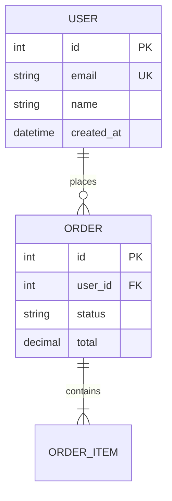

# Generate ER Diagram

Generate entity-relationship diagrams by analyzing database model definitions in your codebase.

## Usage

```
/er-diagram                            # Comprehensive ER diagram (default)
/er-diagram simple                     # Simple/minimal ER diagram
/er-diagram for user and order tables  # Focused on specific entities
```

## Argument Parsing

Parse `$ARGUMENTS` as follows:
- `simple` → use simple template (minimal visualization)
- `comprehensive` or empty → use comprehensive template (default)
- anything else → treat as focus description (which entities/tables to diagram)

## Supported ORMs

### Python
- SQLAlchemy (declarative, classical mapping)
- Django ORM
- Tortoise ORM
- SQLModel
- Peewee

### JavaScript/TypeScript
- TypeORM
- Prisma
- Sequelize
- Mongoose (MongoDB)

### Ruby
- ActiveRecord (Rails)

### Other
- GORM (Go)
- Entity Framework (C#)
- Hibernate (Java)

## Process

You are a database documentation expert. When this skill is invoked:

1. **Search for database model files** in the codebase:
   - `models.py`, `models/`, `entities/` (Python/Django/SQLAlchemy)
   - `schema.prisma` (Prisma)
   - `*.entity.ts` (TypeORM)
   - `db/migrate/`, `app/models/` (Rails)
   - Any files with ORM imports or model definitions

2. **Parse model definitions** to extract:
   - Table/collection names and corresponding classes
   - Column names, data types, and constraints
   - Primary key definitions
   - Foreign key relationships between tables
   - Indexes and unique constraints

3. **Identify relationships**:
   - One-to-one (e.g., User → Profile)
   - One-to-many (e.g., User → Orders)
   - Many-to-many (e.g., User ↔ Role via junction table)

4. **Generate valid Mermaid `erDiagram` syntax** with:
   - Entity blocks with typed attributes
   - PK, FK, UK constraint markers
   - Relationship lines with cardinality notation
   - Descriptive relationship labels

5. **Select and populate the template** from `references/`:
   - `template_comprehensive.md` — detailed with column docs, relationships, constraints, business rules (default)
   - `template_simple.md` — minimal with just the diagram and entity summaries
   - `template_er_detailed.md` — full ER documentation with indexes, migration notes, data types

6. **Save to `docs/data-model.md`**

## Mermaid ER Syntax Reference



Relationship notation:
- `||--||` one-to-one
- `||--o{` one-to-many
- `}o--o{` many-to-many
- `||--o|` one-to-zero-or-one

## Output Format

The output document should include:
1. The Mermaid ER diagram in a code block
2. Entity/table descriptions
3. Relationship explanations
4. Constraint and index details (comprehensive mode)

## Notes

- Create the `docs/` directory if it doesn't exist
- Templates in `references/` use `{{PLACEHOLDER}}` syntax — replace all placeholders with actual discovered values
- If no database models are found, inform the user and suggest what model files to look for
